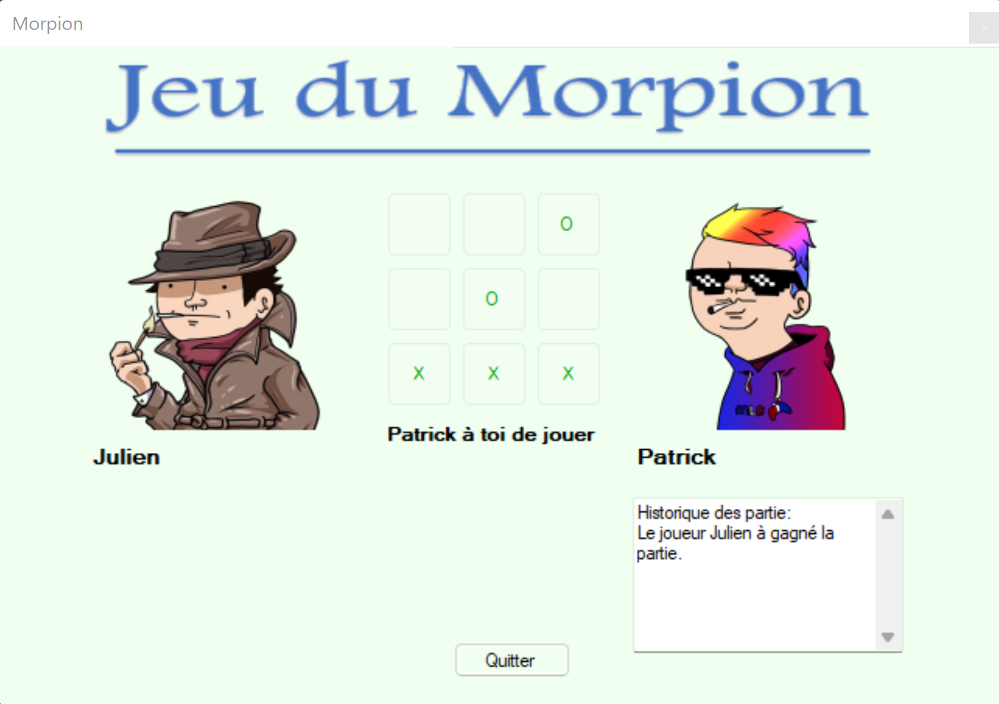

<h1 align="center">
  
</h1>

---

# Morpion

## Petit résumé
- Le morpion est un jeu de réflexion se pratiquant à deux joueurs au tour par tour et dont le but est de créer le premier un alignement sur une grille.

## Objectifs
- Créer une application en vb permettant de jouer au morpion.

## Techno
- VB.Net
- Visual Studio

## UI

## Auteur
- [@Pierre](https://github.com/Pierre-Portfolio)